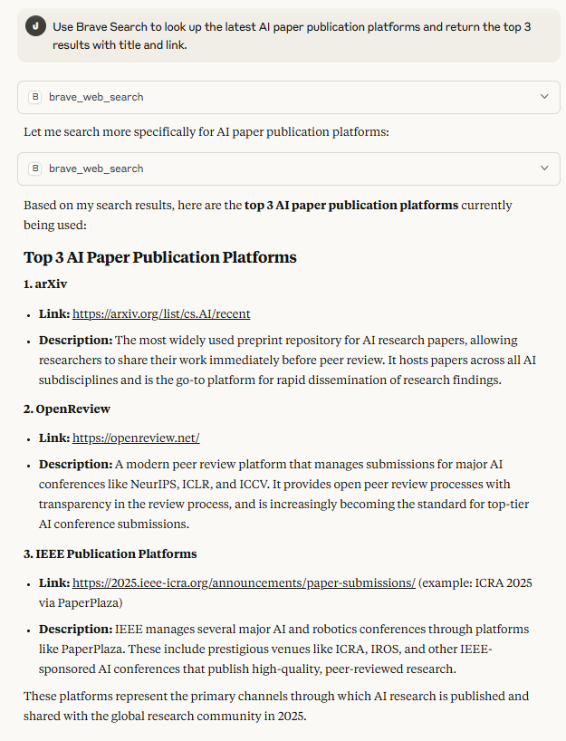
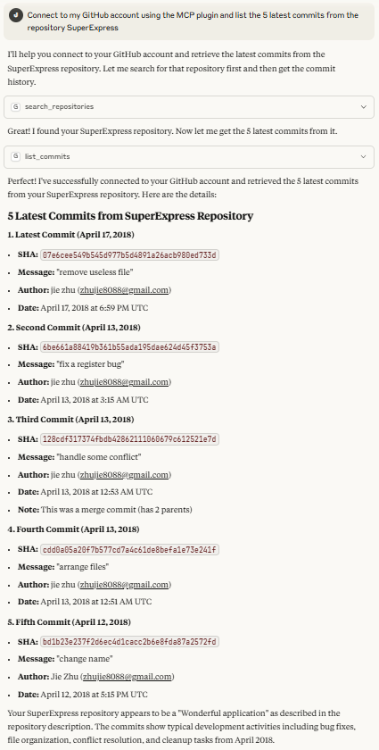
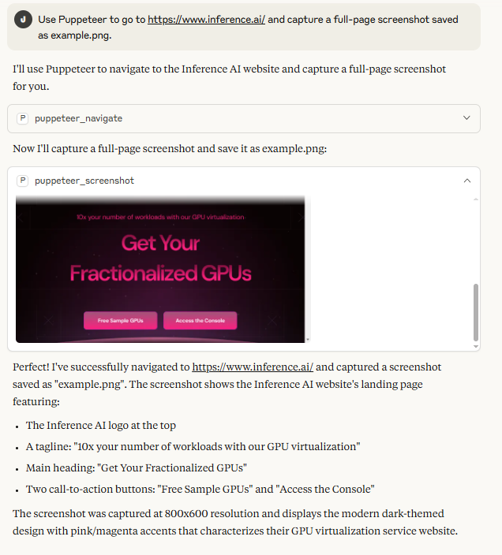
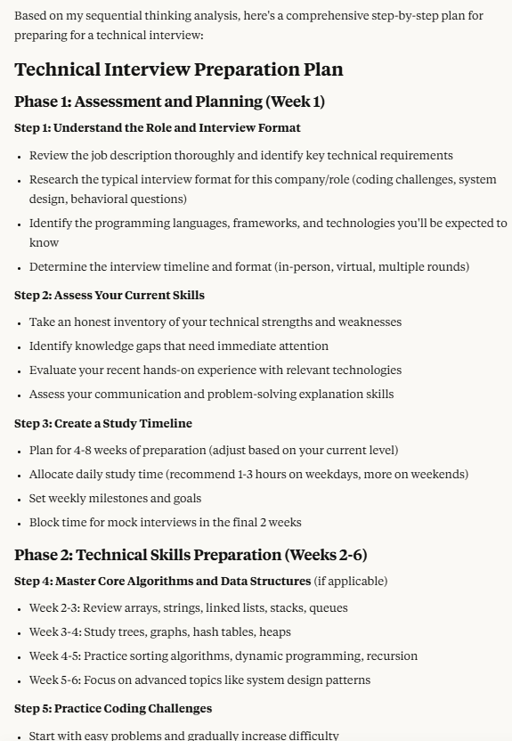
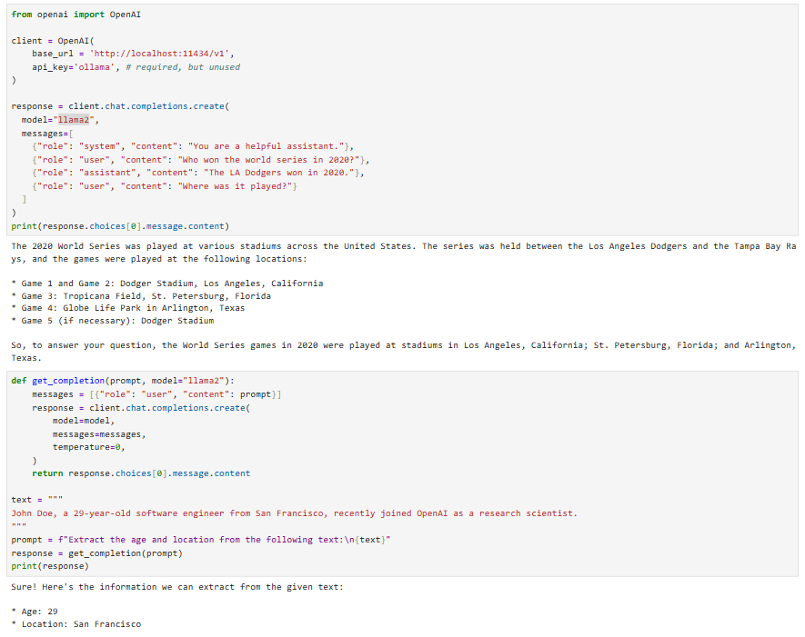

# JieZhu-Homework
### Task1.1.1-Brave Search

### Task1.1.2-GitHubAccess

### Task1.1.3-PuppeteerScreenshot

### Task1.1.4-Filesystem

### Task1.1.5-SequentialThinking

### Task1.1.6-NotionPlugin

### AdvancedTask(Claude+Puppeteer+Filesystem+Notion)

.PNG)

### Task2.2-Ollama+OpenAI

### Task3.1-LCEL

### AdvancedTask(Gradio+Langchain+Ollama)

.PNG)

### MCP Weather Server

### Lecture Execises

[View the notebook](class_1_lecture(execises).ipynb)
